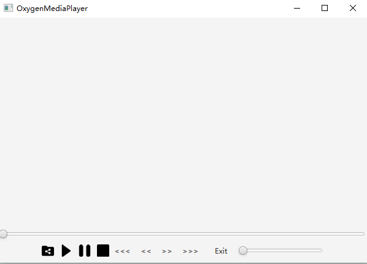
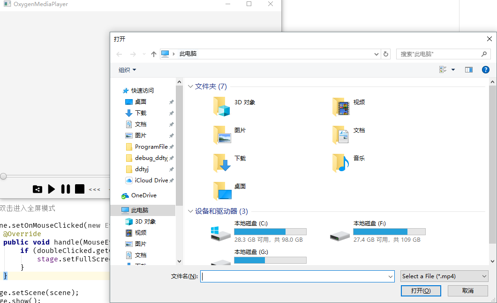
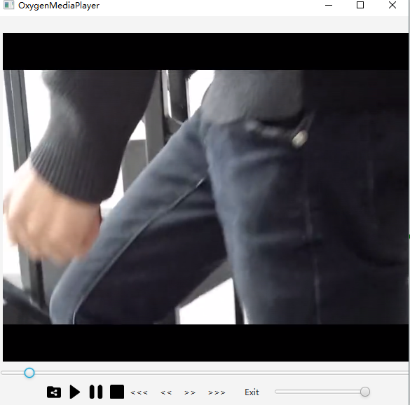
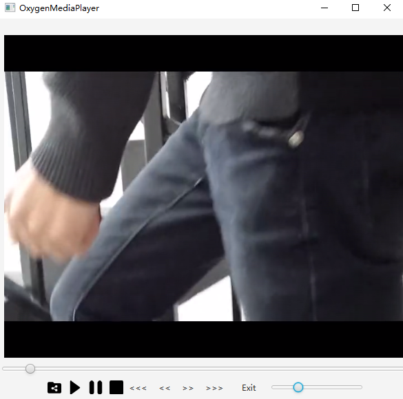

# 第 1 章 课程设计目的与要求

## 一. 课程设计目的

将理论教学中涉及到的知识点贯穿起来，对 OOP 编程、GUI 结合设计题目进行综合性应用，对所学知识达到融会贯通的程度。通过课程设计，学生在下述各方面的能力应该得到锻炼：

1. 进一步巩固、加深学生所学专业课程《java 语言教程》的基本理论知识，理论联系实际，进一步培养学生综合分析问题，解决问题的能力。
2. 全面考核学生所掌握的基本理论知识及其实际业务能力，从而达到提高学生素质的最终目的。
3. 利用所学知识，开发小型应用系统，掌握运用 java 语言编写调试应用系统程序，训练独立开发应用系统，进行数据处理的综合能力。
4. 对于给定的设计题目，如何进行分析，理清思路，并给出相应的数学模型。
5. 掌握面向对象程序设计的方法。
6. 熟练掌握 java 语言的基本语法，灵活运用各种数据类型。
7. 进一步掌握在集成环境下如何调试程序（单步调试，设置断点、观察表达式，分块调试）和修改程序。
## 二. 课程设计的实验环境
   硬件要求能运行 Windows 操作系统的微机系统。java 语言应用程序开发软件使用：eclipse 系统，或其他 C++语言应用程序开发软件。
## 三. 课程设计的预备知识
   熟悉 java 语言程序设计的基本知识及编辑器的使用方法。
## 四. 课程设计要求
1. 仔细分析设计题目，画出程序流程图，编写程序源代码。
2. 积极上机调试源程序，增强编程技巧与调程能力。
3. 认真书写课程设计预习报告,课程设计说明书。
4. 遵守课程设计要求和机房管理制度，服从指导教师的安排，确保课程设计的顺利完成课程设计内容。

<br>

# 第 2 章 课程设计内容

## 一. 系统需求分析

本次我选择的题目是 Java 媒体播放器的设计与实现，具体要求有

1. 实现视频文件的正确播放；
2. 能够实现对视频播放的控制，如暂停，播放，快进，快退，上一个，下一个等功能；
3. 能够进行文件视频的选择，全屏，音量的控制，拖动，播放模式的控制等；
4. 任意改变播放视频界面大小等功能。

## 二. 系统设计

### 整体设计

根据所选择的设计要求，我需要一个 java 图形框架。不同于一般同学们选择的 awt 或者 Swing 图形框架，我选择了较新的**JavaFX**作为图形框架。选择 JavaFX 的好处有：

1. 可采用**MVC**架构完成软件设计。
2. 视图（view）模块可由**FXML**文件和**CSS**文件完成，加快开发速度。FXML 是基于 XML 的标签语言，对于图形设计相比传统 java 图形开发更加方便。FXML 可关联 CSS 文件直接设计界面风格，兼容性很强。
3. 控制（control）模块由 java 文件完成，可直接关联 FXML 标签实现控制功能。
4. 得益于 JavaFX 是以丰富互联网程序（RIA）这一概念为目标的开发框架， JavaFX 提供了丰富的媒体控制类。

开发的时候实现了 mvc 架构，使得视图、控制、模型分离。应本软件对于模型 module 并没有过多涉及，所以仅采用 view-control 设计。具体

### 细节设计

1. Main 类是主程序类，控制整体窗口逻辑

```java
//Main.java
//import已略
/**
 * 整体窗口逻辑
 * @author ddtyjmyjm
 */
public class Main extends Application {

    public static void main(String[] args) {
        launch(args);
    }


    @Override
    public void start(Stage stage) throws Exception {
        Parent root = FXMLLoader.load(getClass().getResource("Amedia.fxml"));

        Scene scene = new Scene(root);
        stage.setTitle("OxygenMediaPlayer");

        /**
         * 双击进入全屏模式
         */
        scene.setOnMouseClicked(new EventHandler<MouseEvent>() {
            @Override
            public void handle(MouseEvent doubleClicked) {
                if (doubleClicked.getClickCount() == 2) {
                    stage.setFullScreen(true);
                }
            }
        });
        stage.setScene(scene);
        stage.show();
    }
}
```

2. AmediaContoller 负责视频各种操作的控制，包括读取文件、播放、暂停、停止、快进、快退、退出、音量调整、进度调整

```java
//AmediaContoller.java
//import部分已经省略
public class AmediaController implements Initializable {
    private String filePath;
    private MediaPlayer mediaPlayer;
    @FXML
    private MediaView mediaView;
    @FXML
    private Slider slider;
    @FXML
    private Slider seekSlider;

    @FXML
    private void handleOpen(ActionEvent event) {
        FileChooser fileChooser = new FileChooser();
        FileChooser.ExtensionFilter filter = new FileChooser.ExtensionFilter("Select a File (*.mp4)", "*.mp4");
        fileChooser.getExtensionFilters().add(filter);
        File file = fileChooser.showOpenDialog(null);
        filePath = file.toURI().toString();

        if (filePath != null) {
            Media media = new Media(filePath);
            mediaPlayer = new MediaPlayer(media);
            mediaView.setMediaPlayer(mediaPlayer);
           
            /**
             * media窗体大小
             */
            DoubleProperty width = mediaView.fitWidthProperty();
            DoubleProperty height = mediaView.fitHeightProperty();
            width.bind(Bindings.selectDouble(mediaView.sceneProperty(), "width"));
            height.bind(Bindings.selectDouble(mediaView.sceneProperty(), "height"));

            /**
             *音量controller
             */
            slider.setValue(mediaPlayer.getVolume() * 100);
            slider.valueProperty().addListener(new InvalidationListener() {
                @Override
                public void invalidated(Observable observable) {
                    mediaPlayer.setVolume(slider.getValue() / 100);
                }
            });
            /**
             *进度controller
             */
            mediaPlayer.currentTimeProperty().addListener(new ChangeListener<Duration>() {
                @Override
                public void changed(ObservableValue<? extends Duration> observable, Duration oldValue, Duration newValue) {
                    seekSlider.setValue(newValue.toSeconds());
                }
            });
            
            /**
             *进度条点击
             */
            seekSlider.setOnMouseClicked(new EventHandler<MouseEvent>() {
                @Override
                public void handle(MouseEvent event) {
                    mediaPlayer.seek(Duration.seconds(seekSlider.getValue()));
                }
            });

            mediaPlayer.play();
        }

    }

    @FXML
    private void handlePause(ActionEvent event) {
        mediaPlayer.pause();
    }

    @FXML
    private void handlePlay(ActionEvent event) {
        mediaPlayer.play();
        mediaPlayer.setRate(1);
    }

    @FXML
    private void handleStop(ActionEvent event) {
        mediaPlayer.stop();
    }

    @FXML
    private void handleFast(ActionEvent event) {
        mediaPlayer.setRate(1.5);
    }

    @FXML
    private void handleFaster(ActionEvent event) {
        mediaPlayer.setRate(2);
    }

    @FXML
    private void handleSlow(ActionEvent event) {
        mediaPlayer.setRate(0.75);
    }

    @FXML
    private void handleSlower(ActionEvent event) {
        mediaPlayer.setRate(0.5);
    }

    @FXML
    private void handleExit(ActionEvent event) {
        System.exit(0);
    }

    @Override
    public void initialize(URL location, ResourceBundle resources) {
    }

}
```

3. Amedia.fxml负责GUI控制（已略）
4. style.css负责窗口风格设计（已略）


# 第三章 系统实现及运行结果
1. 首先运行jar文件（环境为jre 1.8）



2. 点击左下角文件夹open按钮，调用系统选择文件窗口



3. 选中文件后进入主窗口



4. 可注意进度条跟随播放进度



5. 关于暂停和快进快退因无法打印动图，可现场演示

# 第四章 总结
本次设计的最重要感受是要学会阅读官方文档。应为JavaFX在国内几乎没有教程，所以我阅读了官方文档进行编写，同时关注了国外教程。同时注意到了MVC结构的重要性，保证了业务逻辑的分离。在进行变成过程中对于OOP的封装 - 继承 - 多态有了更深刻的理解。课程设计过程当中还遇到很多问题，有的问题无法解决只能想办法避免。

经过这次课程设计，我同样运用到了学习前端知识的内容，意识到了现在GUI设计基本都是基于标签语言的这一现象，更加认同了前端技术的发展。